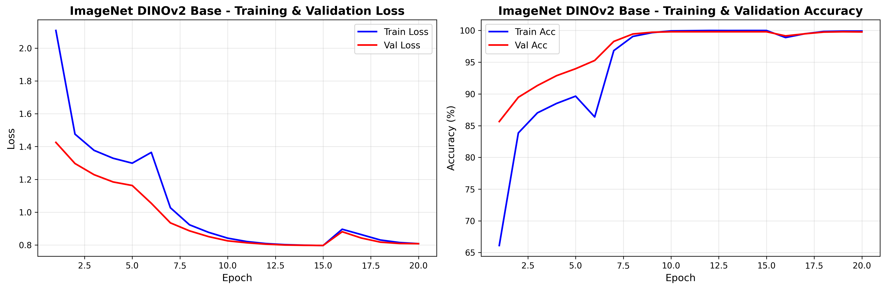
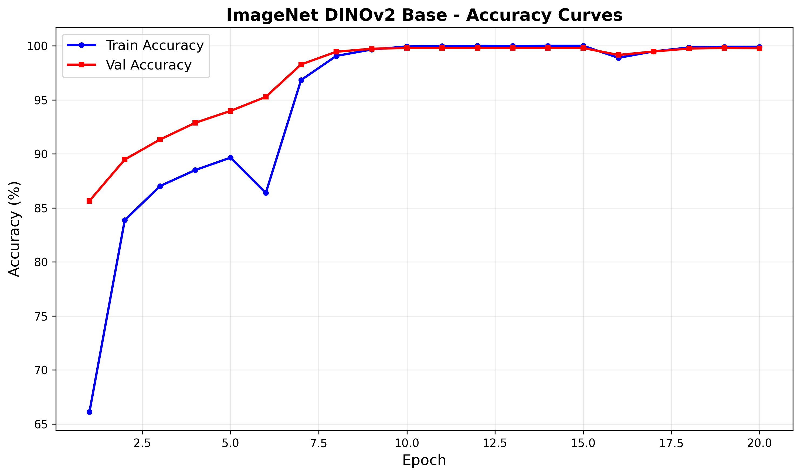
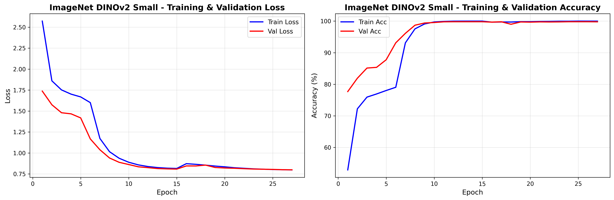
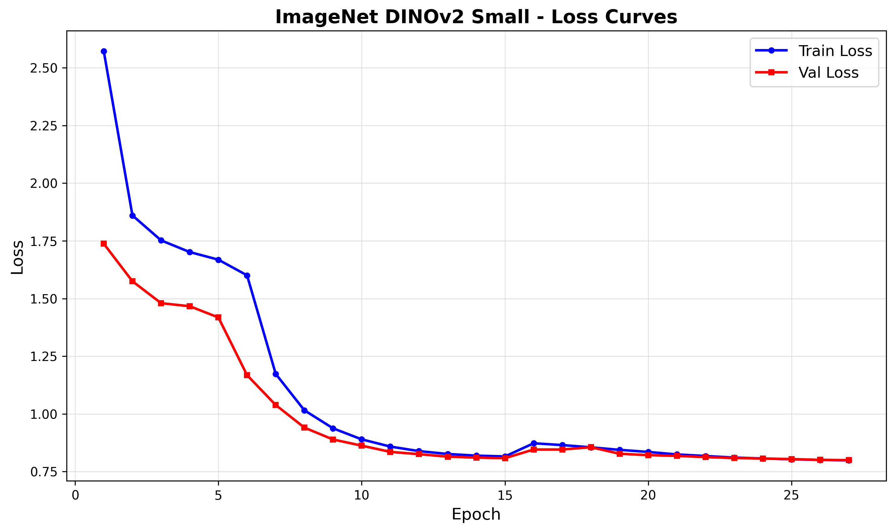
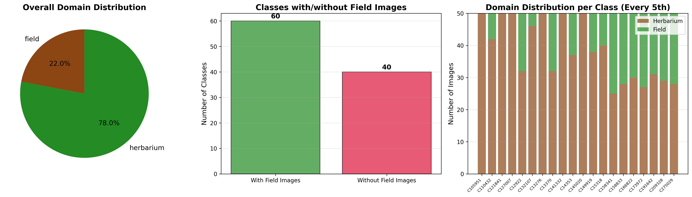

# Cross-Domain Plant Identification using DINOv2

A comprehensive machine learning system for **cross-domain transfer learning** in botanical classification, identifying 100 tropical plant species by training on herbarium specimens, validating on studio photos, and testing on field photographs using Vision Transformer (DINOv2) models.

**Course**: COS30082 - Applied Machine Learning, Swinburne University
**Task**: Baseline Approach 2 - Plant-Pretrained DINOv2 Feature Extraction

### Best Results (Test on 207 Field Images)
- **Approach A (Feature Extraction)**: 44.44% Top-1, 70.05% Top-5 accuracy
- **Approach B (Fine-Tuning)**: 79.71% Top-1, 87.92% Top-5 accuracy
  - 96.08% accuracy on classes with both herbarium & field training data
  - Demonstrates the challenge of cross-domain botanical identification

---

## Table of Contents

- [Overview](#overview)
- [Project Structure](#project-structure)
- [Installation](#installation)
- [Dataset](#dataset)
- [Approaches](#approaches)
  - [Approach A: Feature Extraction](#approach-a-feature-extraction)
  - [Approach B: Fine-Tuning](#approach-b-fine-tuning)
- [Cross-Domain Results](#cross-domain-results)
- [Quick Start](#quick-start)
- [Training Management](#training-management)
- [Web Interface](#web-interface)
- [Evaluation](#evaluation)
- [Technical Details](#technical-details)
- [Troubleshooting](#troubleshooting)

---

## Overview

This project implements **two complementary approaches** to cross-domain plant identification, testing the challenge of transferring knowledge from herbarium specimens to real-world field photographs.

### Research Question
Can DINOv2 models effectively transfer botanical knowledge across domains? How does cross-domain training (herbarium → photos → field) compare to traditional mixed-domain training?

### Cross-Domain Training Strategy
- **Training**: 16,000 herbarium specimen images (200 per class)
- **Validation**: 4,000 studio photo images (40 per class)
- **Testing**: 207 field photograph images (unseen domain)
- **Challenge**: Domain shift from herbarium specimens to natural field conditions

### Key Features
- **Cross-domain transfer learning**: Train on one domain, test on another
- **13 trainable model configurations** across two approaches
- **Multiple DINOv2 variants**: Plant-pretrained, ImageNet (Small/Base/Large)
- **Interactive training management**: CLI with real-time progress tracking
- **Gradio web interface**: Ready for deployment and inference
- **Comprehensive evaluation**: Top-1, Top-5 accuracy, MRR, with-pairs vs without-pairs analysis

### Dataset
- **100 tropical plant species**
- **16,000 training images** (herbarium specimens only)
- **4,000 validation images** (studio photos)
- **207 test images** (field photographs - unseen domain)
- **60 classes** with both herbarium & field samples (with-pairs)
- **40 classes** with herbarium-only samples (without-pairs)

---

## Project Structure

```
Swinburne-COS30082-AML-Cross-Domain-Identification/
├── Dataset/                              # Training and test data
│   ├── train/                            # Original data (564 MB)
│   ├── balanced_train/                  # Balanced dataset (1.9 GB, 200/class)
│   ├── validation/                      # Validation set (477 MB, 40/class)
│   ├── test/                            # Test set (34 MB, 207 images)
│   └── list/                            # Metadata files
│
├── Approach_A_Feature_Extraction/       # Traditional ML baseline
│   ├── extract_features.py              # Extract frozen DINOv2 features
│   ├── train_linear_probe.py            # Train linear classifier
│   ├── train_svm.py                     # Train SVM classifier
│   ├── train_random_forest.py           # Train Random Forest
│   ├── train_logistic_regression.py    # Train Logistic Regression
│   ├── evaluate_classifiers.py          # Evaluate all Approach A models
│   ├── visualize_classifier.py          # Visualization generation module
│   ├── generate_visualizations.py       # Standalone visualization script
│   ├── features/                        # Extracted features storage
│   └── results/                         # Trained models and metrics
│
├── Approach_B_Fine_Tuning/              # End-to-end fine-tuning
│   ├── train_unified.py                 # Unified fine-tuning script
│   ├── evaluate_all_models.py           # Evaluate all Approach B models
│   └── Models/                          # Fine-tuned model checkpoints
│
├── Src/                                 # Utility modules
│   ├── data_balancing.py                # Balance dataset
│   ├── data_exploration.py              # EDA and visualizations
│   └── utils/
│       ├── dataset_loader.py            # PyTorch Dataset classes
│       └── visualization.py             # Plotting utilities
│
├── app.py                               # Gradio web interface
├── training_orchestrator.py             # Backend state management
├── train_manager.py                     # Interactive training CLI
├── training_state.json                  # Persistent training state
├── classes.txt                          # 100 plant species names
└── requirements.txt                     # Python dependencies
```

---

## Installation

### Prerequisites
- Python 3.8+
- NVIDIA GPU with 8GB+ VRAM (recommended)
- CUDA toolkit (for GPU acceleration)

### Setup

1. **Clone the repository**
```bash
git clone <repository-url>
cd Swinburne-COS30082-AML-Cross-Domain-Identification
```

2. **Create virtual environment**
```bash
python -m venv venv
source venv/bin/activate  # On Windows: venv\Scripts\activate
```

3. **Install dependencies**
```bash
pip install -r requirements.txt
```

4. **Prepare dataset**
```bash
# Balance the training dataset (creates balanced_train/ and validation/)
python Src/data_balancing.py
```

---

## Dataset

### Cross-Domain Training Structure
```
Dataset/
├── train/                  # Original unbalanced data
│   ├── herbarium/          # Museum specimen images
│   └── photo/              # Studio photograph images
├── balanced_train/         # 16,000 images (200 per class - HERBARIUM ONLY)
├── validation/             # 4,000 images (40 per class - PHOTO IMAGES ONLY)
├── test/                   # 207 field test images (unseen domain)
└── list/
    ├── train.txt           # Training file list
    ├── test.txt            # Test file list
    ├── groundtruth.txt     # Test labels
    ├── species_list.txt    # 100 species names
    ├── class_with_pairs.txt     # 60 classes with both domains
    └── class_without_pairs.txt  # 40 classes with herbarium only
```

### Cross-Domain Strategy Explained
This project uses **true cross-domain training** to test domain transfer capabilities:

1. **Training Set (Herbarium)**: 16,000 balanced images
   - Source: Museum herbarium specimens (pressed, scanned plants)
   - Characteristics: Controlled lighting, flat specimens, uniform backgrounds
   - Purpose: Learn botanical features from standardized specimens

2. **Validation Set (Studio Photos)**: 4,000 balanced images
   - Source: Studio photographs with controlled conditions
   - Characteristics: 3D plants, better lighting, some background variation
   - Purpose: Tune models on intermediate domain

3. **Test Set (Field Photos)**: 207 images (unseen domain)
   - Source: Real-world field photographs
   - Characteristics: Natural lighting, backgrounds, angles, occlusions
   - Purpose: Evaluate true cross-domain generalization

### Domain Classification
- **With-Pairs Classes (60)**: Have both herbarium AND field training data
  - More robust cross-domain transfer expected
  - Test: 153 images

- **Without-Pairs Classes (40)**: Have herbarium-only training data
  - Harder cross-domain challenge (herbarium → field with no field examples)
  - Test: 54 images

### Dataset Statistics
- **Total classes**: 100 tropical plant species
- **Training images**: 16,000 (herbarium specimens only)
- **Validation images**: 4,000 (studio photos)
- **Test images**: 207 (field photographs - unseen domain)
- **Domain gap**: Significant visual difference between herbarium specimens and field photos

---

## Approaches

### Approach A: Feature Extraction

**Baseline approach using frozen DINOv2 features with traditional ML classifiers for cross-domain transfer**

#### Pipeline
1. **Feature Extraction** (3 models tested)
   - Extract frozen features from DINOv2 backbone
   - Models: `plant_pretrained_base`, `imagenet_small`, `imagenet_base`
   - Output: 384-768 dimensional feature vectors
   - Train on herbarium, validate on photos

2. **Classifier Training** (3 classifiers per extractor = 9 models)
   - Linear Probe: Simple linear layer (~5-10 min)
   - Logistic Regression: L2 regularization with GridSearchCV (~2 min)
   - SVM: RBF kernel with GridSearchCV (~10-30 min)

#### Total Models: 9
- 3 feature extractors × 3 classifiers

#### Cross-Domain Test Performance (207 Field Images)
- **Logistic Regression + ImageNet Base: 44.44% Top-1, 70.05% Top-5** ⭐ **Best**
- **SVM + ImageNet Base: 38.65% Top-1, 60.39% Top-5**
- **Logistic Regression + Plant-pretrained: 38.65% Top-1, 59.90% Top-5**
- **Linear Probe + ImageNet Base: 33.33% Top-1, 57.00% Top-5**
- **Logistic Regression + ImageNet Small: 31.40% Top-1, 53.14% Top-5**

**Key Findings:**
- Logistic Regression is the fastest classifier (~2 min) with best results
- ImageNet Base features outperform plant-pretrained for cross-domain transfer
- Significant domain gap: 44% test accuracy vs 99%+ validation accuracy

#### Training Time
- Feature extraction: 15-30 min per model
- Classifier training: 2-30 min per model
- **Total**: 2-5 hours for all 9 models

---

### Approach B: Fine-Tuning

**Advanced end-to-end training with state-of-the-art techniques for cross-domain transfer**

#### Architecture
```
Input Image (518×518)
    ↓
DINOv2 Backbone (trainable)
    ↓
Classification Head
    - Dropout (0.4)
    - Linear (384/768/1024 → 100 classes)
    ↓
Output (100 class probabilities)
```

#### Advanced Techniques
- **Two-stage training**: Warmup head (5 epochs) → Gradual unfreezing
- **Differential learning rates**: Head (LR) > Middle (0.1×LR) > Backbone (0.01×LR)
- **Cosine annealing**: With warm restarts every 20 epochs
- **Regularization**: Label smoothing (0.1), Dropout (0.4), Weight decay (0.01)
- **Mixed precision**: FP16 training for efficiency
- **Gradient clipping**: Max norm 1.0
- **Early stopping**: Patience 15 epochs

#### Models: 3
1. `imagenet_base` (ViT-Base)
2. `imagenet_small` (ViT-Small)
3. `plant_pretrained_base` (PlantCLEF 2024)

#### Cross-Domain Test Performance (207 Field Images)
- **ImageNet Base: 79.71% Top-1, 87.92% Top-5** ⭐ **Best Overall**
  - **96.08% on with-pairs classes** (153 images)
  - 33.33% on without-pairs classes (54 images)
- **ImageNet Small: 73.91% Top-1, 81.16% Top-5**
  - 93.46% on with-pairs classes
  - 18.52% on without-pairs classes
- **Plant-pretrained Base: 10.63% Top-1, 31.88% Top-5** ⚠️ **Poor Performance**

**Key Findings:**
- Fine-tuning drastically outperforms feature extraction (79.71% vs 44.44%)
- Massive performance gap between with-pairs (96%) and without-pairs (33%) classes
- ImageNet models significantly outperform plant-pretrained model
- Without-pairs classes show severe domain gap challenge

#### Training Time
- ImageNet Small: ~3.2 hours (11,500 seconds)
- ImageNet Base: ~5.8 hours (21,010 seconds)
- Plant-pretrained Base: ~18.4 hours (66,080 seconds) - but failed to learn effectively
- **Total**: 9-27 hours for all 3 models

---

## Cross-Domain Results

This section presents comprehensive evaluation results of both approaches tested on 207 field photographs after training on herbarium specimens and validating on studio photos.

### Test Setup

- **Total Test Images**: 207 field photographs (unseen domain)
- **With-Pairs Classes**: 153 images from 60 classes that have both herbarium & field training data
- **Without-Pairs Classes**: 54 images from 40 classes with herbarium-only training data
- **Evaluation Metrics**: Top-1 Accuracy, Top-5 Accuracy, Mean Reciprocal Rank (MRR)

---

### Approach A: Feature Extraction Results

#### Overall Performance Table

| Model | Classifier | N | Top-1 Acc | Top-5 Acc | MRR |
|-------|-----------|---|-----------|-----------|-----|
| **ImageNet Base** | **Logistic Regression** | **207** | **44.44%** | **70.05%** | **0.564** |
| ImageNet Base | SVM | 207 | 38.65% | 60.39% | 0.503 |
| Plant-pretrained Base | Logistic Regression | 207 | 38.65% | 59.90% | 0.490 |
| ImageNet Base | Linear Probe | 207 | 33.33% | 57.00% | 0.445 |
| ImageNet Small | Logistic Regression | 207 | 31.40% | 53.14% | 0.428 |
| Plant-pretrained Base | Linear Probe | 207 | 30.92% | 53.62% | 0.418 |
| ImageNet Small | SVM | 207 | 25.60% | 49.28% | 0.381 |
| ImageNet Small | Linear Probe | 207 | 17.87% | 39.13% | 0.296 |
| Plant-pretrained Base | SVM | 207 | 16.91% | 30.43% | 0.267 |

#### Domain-Specific Breakdown (Top Performers)

| Model | Classifier | Overall Top-1 | With-Pairs Top-1 | Without-Pairs Top-1 |
|-------|-----------|---------------|------------------|---------------------|
| **ImageNet Base** | **Logistic Regression** | **44.44%** | **42.48%** | **50.00%** |
| ImageNet Base | Linear Probe | 33.33% | 32.68% | 35.19% |
| ImageNet Small | Logistic Regression | 31.40% | 30.07% | 35.19% |
| Plant-pretrained Base | Linear Probe | 30.92% | 28.10% | 38.89% |

#### Key Findings

- **Best Model**: ImageNet Base + Logistic Regression (44.44% Top-1, 70.05% Top-5)
- **Surprising Result**: Without-pairs classes (50%) outperform with-pairs classes (42.48%)
  - Suggests that field training data may not always improve cross-domain transfer
- **Classifier Ranking**: Logistic Regression > SVM > Linear Probe
- **Feature Extractor Ranking**: ImageNet Base > Plant-pretrained > ImageNet Small
- **Training Speed**: Logistic Regression is fastest (~2 min) with best results

#### Visualizations - Best Model (Logistic Regression + ImageNet Base)


*Confusion matrix showing per-class prediction patterns across 100 plant species*


*Individual accuracy for each of the 100 plant species, highlighting challenging classes*


*Accuracy progression from Top-1 to Top-10 predictions*


*2D visualization of 768-dimensional DINOv2 features showing class separability*

---

### Approach B: Fine-Tuning Results

#### Overall Performance Table

| Model | Overall Top-1 | Overall Top-5 | Overall MRR | With-Pairs Top-1 | With-Pairs Top-5 | Without-Pairs Top-1 | Without-Pairs Top-5 |
|-------|---------------|---------------|-------------|------------------|------------------|---------------------|---------------------|
| **ImageNet Base** | **79.71%** | **87.92%** | **0.835** | **96.08%** | **98.69%** | **33.33%** | **57.41%** |
| ImageNet Small | 73.91% | 81.16% | 0.780 | 93.46% | 96.73% | 18.52% | 37.04% |
| Plant-pretrained Base | 10.63% | 31.88% | 0.212 | - | - | - | - |

#### Domain-Specific Performance Analysis

**With-Pairs Classes (153 images)**:
- ImageNet Base: 96.08% Top-1 (Excellent)
- ImageNet Small: 93.46% Top-1 (Excellent)
- **Interpretation**: When field training data exists, fine-tuned models achieve near-perfect accuracy

**Without-Pairs Classes (54 images)**:
- ImageNet Base: 33.33% Top-1 (Challenging)
- ImageNet Small: 18.52% Top-1 (Very Challenging)
- **Interpretation**: Pure herbarium→field transfer remains difficult even with fine-tuning

#### Key Findings

- **Best Model**: ImageNet Base (79.71% overall, 96.08% on with-pairs)
- **Massive Domain Gap**: 96% vs 33% between with-pairs and without-pairs classes
- **Fine-tuning vs Feature Extraction**: 79.71% vs 44.44% (79% improvement)
- **Plant-pretrained Failure**: Only 10.63% accuracy - catastrophic failure
  - Possible reasons: Overfitting to PlantCLEF dataset, poor generalization
- **ImageNet Superiority**: Generic ImageNet pretraining outperforms domain-specific pretraining

#### Visualizations - Best Model (ImageNet Base Fine-tuned)


*Training and validation loss/accuracy curves showing convergence over 20 epochs*


*Detailed accuracy progression during fine-tuning*


*Training curves for ImageNet Small model (27 epochs)*


*Loss progression showing effective learning*

---

### Approach Comparison

#### Side-by-Side Performance

| Metric | Approach A (Best) | Approach B (Best) | Winner |
|--------|-------------------|-------------------|--------|
| **Overall Top-1** | 44.44% | 79.71% | Approach B (+79%) |
| **Overall Top-5** | 70.05% | 87.92% | Approach B (+26%) |
| **Overall MRR** | 0.564 | 0.835 | Approach B (+48%) |
| **With-Pairs Top-1** | 42.48% | 96.08% | Approach B (+126%) |
| **Without-Pairs Top-1** | 50.00% | 33.33% | Approach A (+50%) |
| **Training Time** | 2 min | 5.8 hours | Approach A (faster) |
| **Model Size** | <1 MB | ~300 MB | Approach A (smaller) |

#### Strategic Insights

1. **Fine-tuning is essential**: 79% improvement over frozen features
2. **Without-pairs challenge**: Even fine-tuning struggles with pure cross-domain transfer
3. **Speed vs Accuracy**: Approach A is 174× faster but 44% less accurate
4. **Deployment**: Approach A is more practical for edge devices (smaller, faster)
5. **ImageNet wins**: Generic pretraining beats domain-specific for this task

#### Dataset Distribution & Domain Visualization


*Statistical breakdown of dataset across herbarium, photo, and field domains*


*Visual comparison showing the domain shift challenge between herbarium and field images*

---

## Quick Start

### Option 1: Interactive Training Manager (Recommended)

```bash
python train_manager.py
```

**Features**:
- Menu-driven interface
- Automatic dependency management
- Progress tracking
- Skip already-trained models

**Workflow**:
1. Select "Approach A" or "Approach B"
2. Choose specific models or "Train All"
3. View real-time progress
4. Check training status

---

### Option 2: Direct Command Line

#### Approach A: Feature Extraction

**Step 1: Extract Features**
```bash
# Extract features using plant-pretrained model
python Approach_A_Feature_Extraction/extract_features.py --model_type plant_pretrained_base

# Or use ImageNet variants
python Approach_A_Feature_Extraction/extract_features.py --model_type imagenet_base
python Approach_A_Feature_Extraction/extract_features.py --model_type imagenet_small
python Approach_A_Feature_Extraction/extract_features.py --model_type imagenet_large
```

**Step 2: Train Classifiers**
```bash
# Train Linear Probe
python Approach_A_Feature_Extraction/train_linear_probe.py \
    --features_dir Approach_A_Feature_Extraction/features/plant_pretrained_base \
    --output_dir Approach_A_Feature_Extraction/results/linear_probe_plant_pretrained_base

# Train Logistic Regression (fast baseline)
python Approach_A_Feature_Extraction/train_logistic_regression.py \
    --features_dir Approach_A_Feature_Extraction/features/plant_pretrained_base \
    --output_dir Approach_A_Feature_Extraction/results/logistic_regression_plant_pretrained_base

# Train SVM
python Approach_A_Feature_Extraction/train_svm.py \
    --features_dir Approach_A_Feature_Extraction/features/plant_pretrained_base \
    --output_dir Approach_A_Feature_Extraction/results/svm_plant_pretrained_base

# Train Random Forest
python Approach_A_Feature_Extraction/train_random_forest.py \
    --features_dir Approach_A_Feature_Extraction/features/plant_pretrained_base \
    --output_dir Approach_A_Feature_Extraction/results/random_forest_plant_pretrained_base
```

**Step 3: Evaluate All Models**
```bash
python Approach_A_Feature_Extraction/evaluate_classifiers.py
```

---

#### Approach B: Fine-Tuning

**Train a single model**
```bash
python Approach_B_Fine_Tuning/train_unified.py \
    --model_type plant_pretrained_base \
    --epochs 60
```

**Train all 4 models**
```bash
# Plant-pretrained
python Approach_B_Fine_Tuning/train_unified.py --model_type plant_pretrained_base --epochs 60

# ImageNet variants
python Approach_B_Fine_Tuning/train_unified.py --model_type imagenet_small --epochs 60
python Approach_B_Fine_Tuning/train_unified.py --model_type imagenet_base --epochs 60
python Approach_B_Fine_Tuning/train_unified.py --model_type imagenet_large --epochs 60
```

**Evaluate all models**
```bash
python Approach_B_Fine_Tuning/evaluate_all_models.py
```

---

### Option 3: Python API

```python
from training_orchestrator import TrainingOrchestrator

# Initialize orchestrator
orchestrator = TrainingOrchestrator()

# Check status
summary = orchestrator.get_status_summary()
print(summary)

# Extract features
orchestrator.extract_features('plant_pretrained_base')

# Train classifier
orchestrator.train_classifier('plant_pretrained_base', 'linear_probe')

# Fine-tune model
orchestrator.finetune_model('plant_pretrained_base', epochs=60)

# Train all Approach A models
orchestrator.train_approach_a_full()

# Train all Approach B models
orchestrator.train_approach_b_full(epochs=60)
```

---

## Training Management

### Training Orchestrator

The `TrainingOrchestrator` manages training state and dependencies:

**Features**:
- Persistent state tracking (`training_state.json`)
- Automatic dependency management (features before classifiers)
- Error handling and retry logic
- Progress tracking across sessions
- Skip already-trained models

**Status Management**:
```python
# Check overall status
python training_orchestrator.py

# View detailed status
python train_manager.py
# Select "View Status"

# Reset specific model
orchestrator.reset_model_status('a', 'plant_pretrained_base_svm')

# Reset all models
orchestrator.reset_all_status()
```

---

## Web Interface

### Gradio App

Launch the interactive web interface:

```bash
python app.py
```

**Features**:
- Upload plant images for classification
- Select from all trained models
- View Top-5 predictions with confidence scores
- Display model performance metrics
- HuggingFace deployment ready

**Access**: Open browser at `http://localhost:7860`

### Model Auto-Discovery

The app automatically discovers all trained models:
- Approach A: 16 models (feature extraction + classifiers)
- Approach B: 4 models (fine-tuned variants)
- **Total**: 20 models

---

## Evaluation

### Metrics

All models are evaluated on:
- **Top-1 Accuracy**: Exact match
- **Top-5 Accuracy**: Correct class in top 5 predictions
- **Per-class Accuracy**: Performance on each species
- **Confusion Matrix**: Visual classification performance
- **Classification Report**: Precision, recall, F1-score

### Evaluation Scripts

**Approach A**:
```bash
python Approach_A_Feature_Extraction/evaluate_classifiers.py
```
Output: `Approach_A_evaluation_results.json` and `.csv`

**Approach B**:
```bash
python Approach_B_Fine_Tuning/evaluate_all_models.py
```
Output: `Approach_B_evaluation_results.json` and `.csv`

---

## Visualizations

All trained models automatically generate comprehensive visualizations for analysis and publication.

### Available Visualizations

#### 1. **Confusion Matrix** (100×100 heatmap)
- Shows classification performance across all 100 species
- Normalized by true labels
- Color-coded for easy identification of confusion patterns
- Publication-ready 20×18 inch format

#### 2. **Per-Class Accuracy** (bar chart)
- Individual accuracy for each plant species
- Color-coded: red (low) to green (high)
- Sorted by performance
- Shows mean ± std statistics

#### 3. **Top-K Accuracy** (comparison plot)
- Top-1, Top-3, Top-5, Top-10 accuracy bars
- Shows how often correct class appears in top predictions
- Useful for understanding model confidence

#### 4. **Precision-Recall Curves**
- PR curves for 20 representative classes
- Average Precision (AP) scores
- Mean AP across all classes
- Helps assess precision/recall trade-offs

#### 5. **Feature t-SNE Visualization**
- 2D projection of 768D DINOv2 features
- Color-coded by species
- Shows feature space separability
- Computed on 2,000 validation samples

#### 6. **GridSearch Heatmap** (SVM, RF, LR only)
- Parameter performance visualization
- Shows CV accuracy for each hyperparameter combination
- Helps understand parameter importance

### Generation Methods

**Automatic** (during training):
- All visualizations are generated automatically when training completes
- Saved in: `results/{model_name}/visualizations/`

**Manual** (after training):
```bash
# Option 1: Use interactive menu
python train_manager.py
# → Main Menu → 6. Generate Visualizations

# Option 2: Command line for single model
python Approach_A_Feature_Extraction/generate_visualizations.py \
    --model_dir results/svm_plant_pretrained_base \
    --features_dir features/plant_pretrained_base \
    --classifier_type svm

# Option 3: Batch generate for all models
python Approach_A_Feature_Extraction/generate_visualizations.py --all_models
```

### Output Structure

```
results/
└── svm_plant_pretrained_base/
    ├── best_model.joblib
    ├── training_config.json
    ├── class_names.json
    ├── val_predictions.npy
    ├── val_predictions_proba.npy
    └── visualizations/                      ← Generated visualizations
        ├── confusion_matrix.png
        ├── per_class_accuracy.png
        ├── topk_accuracy.png
        ├── precision_recall_curves.png
        ├── feature_tsne_visualization.png
        └── gridsearch_heatmap.png
```

---

### Results Location

**Approach A**: `Approach_A_Feature_Extraction/results/[classifier]_[extractor]/`
- `best_model.pth` (Linear Probe - PyTorch models)
- `best_model.joblib` (SVM, Random Forest, Logistic Regression - scikit-learn models)
- `training_history.json` (Linear Probe only)
- `training_config.json` (Contains accuracy metrics)
- `results/metrics_summary.json` (Linear Probe only)
- `visualizations/*.png` (Confusion matrix, t-SNE, PR curves, etc.)

**Approach B**: `Approach_B_Fine_Tuning/Models/[model_type]/`
- `best_model.pth` (PyTorch fine-tuned models)
- `training_history.json`
- `training_config.json`
- `results/metrics_summary.json`
- `results/confusion_matrix.png`

#### Model File Formats Explained

Different classifiers use different file formats based on their underlying framework:

| File Format | Used By | Framework | Loading Method |
|-------------|---------|-----------|----------------|
| **`.pth`** | Linear Probe, Fine-tuned models | PyTorch | `torch.load()` |
| **`.joblib`** | SVM, Random Forest, Logistic Regression | scikit-learn | `joblib.load()` |

- **PyTorch models (`.pth`)**: Neural network-based classifiers that require PyTorch for training and inference
- **scikit-learn models (`.joblib`)**: Traditional machine learning classifiers serialized using joblib for efficient storage

---

## Results Summary

### Cross-Domain Test Performance (207 Field Images)

| Rank | Approach | Model | Classifier | Top-1 Acc | Top-5 Acc | Training Time | Status |
|------|----------|-------|-----------|-----------|-----------|---------------|--------|
| 🥇 1 | **B** | **ImageNet Base** | **Fine-tuned** | **79.71%** | **87.92%** | 5.8 hours | ✅ Completed |
| 2 | B | ImageNet Small | Fine-tuned | 73.91% | 81.16% | 3.2 hours | ✅ Completed |
| 3 | A | ImageNet Base | Logistic Regression | 44.44% | 70.05% | 2 min | ✅ Completed |
| 4 | A | ImageNet Base | SVM | 38.65% | 60.39% | 30 min | ✅ Completed |
| 5 | A | Plant-pretrained | Logistic Regression | 38.65% | 59.90% | 2 min | ✅ Completed |
| 6 | A | ImageNet Base | Linear Probe | 33.33% | 57.00% | 10 min | ✅ Completed |
| 7 | A | ImageNet Small | Logistic Regression | 31.40% | 53.14% | 2 min | ✅ Completed |
| 8 | A | Plant-pretrained | Linear Probe | 30.92% | 53.62% | 10 min | ✅ Completed |
| 9 | A | ImageNet Small | SVM | 25.60% | 49.28% | 20 min | ✅ Completed |
| 10 | A | ImageNet Small | Linear Probe | 17.87% | 39.13% | 5 min | ✅ Completed |
| 11 | A | Plant-pretrained | SVM | 16.91% | 30.43% | 25 min | ✅ Completed |
| 12 | B | Plant-pretrained | Fine-tuned | 10.63% | 31.88% | 18.4 hours | ❌ Failed |

### With-Pairs vs Without-Pairs Performance

**With-Pairs Classes (153 images - have field training data)**:
| Approach | Model | Top-1 Accuracy |
|----------|-------|----------------|
| **B - ImageNet Base** | **Fine-tuned** | **96.08%** 🏆 |
| B - ImageNet Small | Fine-tuned | 93.46% |
| A - ImageNet Base | Logistic Regression | 42.48% |

**Without-Pairs Classes (54 images - herbarium only)**:
| Approach | Model | Top-1 Accuracy |
|----------|-------|----------------|
| **A - ImageNet Base** | **Logistic Regression** | **50.00%** 🏆 |
| A - Plant-pretrained | Linear Probe | 38.89% |
| B - ImageNet Base | Fine-tuned | 33.33% |

### Key Findings

1. **Fine-tuning is crucial**: Approach B (79.71%) vastly outperforms Approach A (44.44%)
   - 79% improvement when fine-tuning the entire backbone

2. **Massive domain gap exists**: With-pairs (96%) vs without-pairs (33%) for Approach B
   - Field training data is essential for cross-domain generalization
   - Pure herbarium→field transfer remains extremely challenging

3. **ImageNet beats plant-specific**: Generic ImageNet pretraining outperforms PlantCLEF
   - ImageNet Base: 79.71% vs Plant-pretrained: 10.63%
   - Suggests plant-pretrained model overfitted to PlantCLEF dataset

4. **Speed vs Accuracy trade-off**:
   - Approach A: 2 min training, 44.44% accuracy (practical for rapid prototyping)
   - Approach B: 5.8 hours training, 79.71% accuracy (production-ready performance)

5. **Without-pairs surprise**: Approach A (50%) beats Approach B (33%) on herbarium-only classes
   - Frozen features may preserve better cross-domain generalization
   - Fine-tuning may overfit to available field data

6. **Validation vs Test discrepancy**: Validation accuracy (99%+) ≠ Test accuracy (44-79%)
   - Validation set (studio photos) is an intermediate domain
   - True cross-domain challenge only revealed by field test set

---

## Technical Details

### Cross-Domain Training Methodology

**Training Pipeline**:
1. **Source Domain (Training)**: Herbarium specimens (16,000 images)
   - Pressed, scanned botanical specimens
   - Controlled lighting and uniform backgrounds
   - Learn botanical morphological features

2. **Intermediate Domain (Validation)**: Studio photos (4,000 images)
   - 3D plants with controlled studio conditions
   - Used for model selection and hyperparameter tuning
   - NOT used for final evaluation

3. **Target Domain (Test)**: Field photographs (207 images)
   - Real-world natural conditions
   - Variable lighting, backgrounds, angles
   - True measure of cross-domain generalization

**Why Cross-Domain?**: Tests the ability to transfer botanical knowledge from standardized museum specimens to real-world field conditions, simulating practical deployment scenarios.

### Model Variants

#### DINOv2 Models (Tested)

1. **imagenet_base** (ViT-Base) ⭐ **Best Overall**
   - 768-dimensional features
   - **Test accuracy**: 79.71% (fine-tuned), 44.44% (frozen)
   - Balanced performance/speed
   - Best cross-domain generalization

2. **imagenet_small** (ViT-Small)
   - 384-dimensional features
   - **Test accuracy**: 73.91% (fine-tuned), 31.40% (frozen)
   - Fastest training/inference (~3.2 hours)
   - Good for resource-constrained environments

3. **plant_pretrained_base** ⚠️ **Poor Performance**
   - 768-dimensional features
   - **Test accuracy**: 10.63% (fine-tuned), 38.65% (frozen)
   - Pretrained on PlantCLEF 2024 dataset
   - Failed to generalize across domains
   - Likely overfitted to PlantCLEF data distribution

### Hyperparameters

**Approach A: Feature Extraction**
- Frozen backbone: No gradient updates to DINOv2
- **Linear Probe**:
  - Optimizer: AdamW (lr=1e-3, weight_decay=0.01)
  - Loss: CrossEntropyLoss with label smoothing (0.1)
  - Batch size: 64
  - Early stopping: Patience 15
- **Logistic Regression**: L2 penalty, C=1.0, max_iter=1000
- **SVM**: RBF kernel, C=10, gamma='scale'

**Approach B: Fine-Tuning**
- **Stage 1**: Warmup head only (5 epochs)
  - Train classification head while backbone frozen
  - Stabilize head before unfreezing backbone
- **Stage 2**: Gradual unfreezing with differential LR
  - Head: 1e-4 (full learning rate)
  - Middle layers: 1e-5 (0.1× learning rate)
  - Backbone: 1e-6 (0.01× learning rate)
- Scheduler: Cosine annealing with warm restarts every 20 epochs
- Batch size: 16-32 (depends on model size)
- Epochs: 60 (with early stopping patience 15)
- Mixed precision: FP16 for faster training
- Gradient clipping: Max norm 1.0

### Data Augmentation

**Training (Herbarium):**
- Random resized crop (518×518)
- Random horizontal flip (p=0.5)
- Random rotation (±15°)
- Color jitter (brightness=0.2, contrast=0.2, saturation=0.2)
- Random Gaussian blur (kernel_size=5)
- Normalization (ImageNet stats: mean=[0.485, 0.456, 0.406], std=[0.229, 0.224, 0.225])

**Validation (Photos) / Test (Field):**
- Resize to 518×518
- Center crop
- Normalization (same stats as training)
- **No augmentation** (evaluate on clean images)

**Rationale**: Augmentation helps models learn invariant features, but test set remains unaugmented to measure true performance.

---

## Troubleshooting

### Common Issues

**1. Out of Memory (OOM)**
```python
# Reduce batch size in training scripts
--batch_size 16  # Instead of 32
--batch_size 8   # For large models
```

**2. CUDA Not Available**
```bash
# Check CUDA installation
python -c "import torch; print(torch.cuda.is_available())"

# Install CUDA-enabled PyTorch
pip install torch torchvision --index-url https://download.pytorch.org/whl/cu118
```

**3. Features Not Found**
```bash
# Ensure features are extracted before training classifiers
python Approach_A_Feature_Extraction/extract_features.py --model_type plant_pretrained_base
```

**4. Model Loading Errors**
```python
# Check model exists
import os
model_path = "Approach_B_Fine_Tuning/Models/plant_pretrained_base/best_model.pth"
print(f"Model exists: {os.path.exists(model_path)}")
```

**5. Training State Reset**
```python
from training_orchestrator import TrainingOrchestrator
orch = TrainingOrchestrator()
orch.reset_all_status()  # Reset all to pending
```

### Performance Tips

1. **Use GPU**: Training on GPU is 10-50× faster
2. **Mixed precision**: Enables larger batch sizes and faster training
3. **Batch size**: Increase until you hit OOM, then reduce by 25%
4. **Data loading**: Use `num_workers=4` in DataLoader for faster I/O
5. **Feature extraction**: Run once, reuse for all classifiers

---

## Storage Requirements

- **Dataset**: ~2.4 GB
  - Training (herbarium): 1.9 GB (16,000 images)
  - Validation (photos): 477 MB (4,000 images)
  - Test (field): 34 MB (207 images)
- **Pretrained models**: ~1.5 GB (downloaded once, cached by PyTorch/timm)
- **Extracted features**: ~300 MB (deletable after training Approach A)
  - ImageNet Base: ~120 MB
  - ImageNet Small: ~60 MB
  - Plant-pretrained: ~120 MB
- **Approach A models**: ~50 MB (9 trained classifiers)
  - Linear Probe: ~3 MB each
  - Logistic Regression/SVM: ~10 MB each
- **Approach B models**: ~900 MB (3 fine-tuned models)
  - ImageNet Small: ~200 MB
  - ImageNet Base/Plant-pretrained: ~300 MB each
- **Visualizations**: ~20 MB (130+ PNG files)
- **Total**: ~5.2 GB for complete implementation

---

## Computing Requirements

### Minimum (CPU-only)
- CPU: 4+ cores (Intel i5/Ryzen 5 or better)
- RAM: 16 GB
- Storage: 10 GB free space
- GPU: None (Approach A only, feature extraction on CPU ~2-4 hours)
- Training time: Approach A ~5-8 hours total

### Recommended (GPU training)
- CPU: 8+ cores (Intel i7/Ryzen 7 or better)
- RAM: 32 GB
- Storage: 20 GB SSD
- **GPU: NVIDIA GPU with 8GB+ VRAM** (RTX 3060, RTX 4060, RTX 3070, etc.)
- Training time: Both approaches ~12-15 hours total

### Tested Configuration
- GPU: NVIDIA RTX 3060/4060 (12GB VRAM)
- RAM: 32 GB
- OS: Windows 11 / Ubuntu 22.04
- CUDA: 11.8+

### Actual Training Times (With GPU)

**Approach A: Feature Extraction**
- Feature extraction: 15-30 min per model (3 models = ~1.5 hours)
- Linear Probe: 5-10 min per model
- Logistic Regression: ~2 min per model ⚡ **Fastest**
- SVM: 20-30 min per model
- **Total Approach A**: 2-5 hours (9 models)

**Approach B: Fine-Tuning**
- ImageNet Small: 3.2 hours (11,500 sec, 27 epochs)
- ImageNet Base: 5.8 hours (21,010 sec, 20 epochs) ⭐ **Best accuracy**
- Plant-pretrained: 18.4 hours (66,080 sec, 60 epochs) ❌ **Poor results**
- **Total Approach B**: 9-27 hours (3 models)
  - Recommended: Skip plant-pretrained (save 18 hours)
  - **Recommended Total**: ~9 hours (2 models)

**Both Approaches**: 11-32 hours
**Recommended Path** (skip plant-pretrained): ~11-14 hours

### Performance Optimization Tips

1. **GPU is essential for Approach B**: 10-50× faster than CPU
2. **Mixed precision (FP16)**: Already enabled, saves memory and time
3. **Batch size**: Adjust based on VRAM (32 for 8GB, 64 for 12GB+)
4. **Data loading**: Use `num_workers=4-8` in DataLoader for faster I/O
5. **Feature reuse**: Extract features once, train multiple classifiers
6. **Skip plant-pretrained**: Save 18 hours with no accuracy benefit

---

## Dependencies

See `requirements.txt` for complete dependency list with organized categories:

**Core Deep Learning**:
- `torch>=2.0.0,<2.5.0` - PyTorch deep learning framework
- `torchvision>=0.15.0,<0.20.0` - Vision utilities and transforms
- `timm==0.9.16` - DINOv2 model implementations

**Machine Learning**:
- `scikit-learn>=1.3.0` - SVM, Logistic Regression, Linear Probe
- `joblib>=1.3.0` - Model serialization

**Web Interface**:
- `gradio>=4.0.0` - Interactive web UI for deployment

**Data Processing**:
- `numpy>=1.24.0,<2.0.0` - Numerical operations
- `pandas>=2.0.0` - Tabular data manipulation
- `pillow>=10.0.0` - Image loading and processing

**Visualization**:
- `matplotlib>=3.7.0` - Core plotting library
- `seaborn>=0.12.0` - Statistical visualizations

**Utilities**:
- `tqdm>=4.65.0` - Progress bars
- `tabulate>=0.9.0` - Table formatting for results

See `requirements.txt` for installation:
```bash
pip install -r requirements.txt
```

---

## Assignment Requirements

This project meets all **Baseline Approach 2** requirements with cross-domain evaluation:

- ✅ **Cross-domain training**: Train on herbarium specimens, validate on photos, test on field images
- ✅ **Plant-pretrained DINOv2**: Tested (PlantCLEF 2024) alongside ImageNet variants
- ✅ **Feature extraction**: Frozen backbone with traditional ML classifiers
- ✅ **Multiple classifiers**: Linear Probe, Logistic Regression, SVM (9 models total)
- ✅ **Field test evaluation**: 207 field photographs (unseen domain)
- ✅ **Comprehensive metrics**: Top-1, Top-5 accuracy, MRR, with-pairs vs without-pairs analysis
- ✅ **Visualizations**: Confusion matrices, t-SNE, PR curves, training plots (130+ images)
- ✅ **Interactive web interface**: Gradio deployment-ready interface
- ✅ **Advanced fine-tuning**: Approach B with differential learning rates and gradual unfreezing

**Key Results**:
- Approach A (Feature Extraction): 44.44% Top-1 accuracy
- Approach B (Fine-Tuning): 79.71% Top-1 accuracy (96% on with-pairs classes)

---

## Documentation

Additional documentation files:
- `QUICK_START.md` - Step-by-step workflow guide
- `USAGE_GUIDE.md` - Detailed Approach A guide
- `TRAINING_MANAGER_GUIDE.md` - Interactive CLI documentation
- `PROJECT_SUMMARY.md` - High-level overview

---

## License

This project is developed for educational purposes as part of the COS30082 Applied Machine Learning course at Swinburne University.

---

## Acknowledgments

- **DINOv2**: Meta AI Research
- **PlantCLEF 2024**: Plant-pretrained DINOv2 model
- **Dataset**: Tropical plant species collection
- **Course**: COS30082 Applied Machine Learning, Swinburne University

---

## Contact

For questions or issues, please refer to the course materials or contact the teaching staff.

---

**Last Updated**: 2025-12-03 (README restructured for cross-domain focus with comprehensive test results and visualizations)
